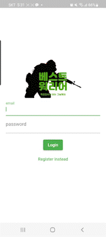

# BEST_WARRIOR


## 프로젝트 소개
### 특급전사를 달성을 위한 소모임 앱
''특급전사'' 군 생활하면서 한 번쯤 달성해보고 싶은 목표입니다. 특급전사을 달성했다는 성취감뿐만 아니라 3~5일 가까이되는 포상휴가까지 주기에 많은 사람들이 특급전사 따려고 하지만 이름이 “특급”전사인만큼 많은 노력과 시간이 필요합니다.  
  
저희 주변에서도 특급전사에 도전하지만 실패한 사람들이 많았습니다. 실패한 이유들을 보면 노력 부족인 경우도 있지만 노하우가 부족하거나 혼자 준비하다가 제풀에 지쳐서 포기하는 경우가 많았습니다. 그러던 중 특급전사를 딴 선임이 특급전사를 따고 싶어하는 후임들과 스터디를 만들어 노하우와 공부방법을 가르쳐 주는 것을 보고 특급전사를 목표로하는 인원들을 위한 소모임 플랫폼 앱이 하나 있으면 좋겠다는 생각이 들어 이번 프로젝트를 진행하게 됐습니다.


## 기능 설명

### 회원가입 & 로그인 기능 & 로그아웃
필요한 정보를 입력후 회원가입후 로그인 합니다.  



### 모임 일정 관리
달력을 통해서 모임의 일정을 추가하고 관리할 수 있습니다  


### 모임 채팅
모임 구성원들 끼리 실시간으로 채팅을 이용하여 여러가지 질문이나 일정을 잡을 수 있습니다.    


### 분야별 모임리스트 & 모임 생성
어떤 모임들이 있는지 한눈에 혹은 분야별로 볼 수 있습니다.  


### 내정보
현재 내 병기본교육 성적과 가입되어있는 혹은 내가 멘토인 방들을 보고 들어갈 수 있다.
  

*마일리지  
멘토들이 멘티들을 특급을 만들때마다 얻는 이득으로 마일리지는 휴가로 교환할 수 있습니다(지휘관님들 재량)  

### 멘토정보 
방을 만든 멘토의  병기본교육 성적과 그동안의 멘티들의 리뷰를 모임 가입전에 확인 할 수 있습니다
   

### 순위표
부대 내 병기본교육 성적의 순위를 한눈에 볼 수 있도록 만들어 재미를 더했습니다.  


## 컴퓨터 구성 / 필수 조건 안내 (Prerequisites)
* sdk: '>=2.18.1 <3.0.0'sdk: '>=2.18.1 <3.0.0'
* dependencies:  
  cupertino_icons: ^1.0.4  
  firebase_core: ^1.24.0  
  firebase_auth: ^3.11.1  
  firebase_database: ^9.1.7  
  font_awesome_flutter: ^9.0.0  
  intl: ^0.17.0  
  table_calendar: ^3.0.6  
  provider: ^6.0.4  
  cloud_firestore: ^3.5.1  
  uuid: ^3.0.1  

## 기술 스택 (Technique Used) 
### Server(back-end)
-Firebase Authentication  
-Firebase Realtime Database  
-Firebase Cloud Firestore
 
### Front-end
-Flutter  
-Dart

## 설치 안내 (Installation Process)
```bash
$ git clone git주소
$ yarn or npm install
$ yarn start or npm run start
```

## 프로젝트 사용법 (Getting Started)

## 프로젝트 관리
* [Pigma](https://www.figma.com/file/hkQDxDwJb9ALVmcVLKTr04/%EB%B2%A0%EC%8A%A4%ED%8A%B8%EC%9B%8C%EB%A6%AC%EC%96%B4?node-id=0%3A1)
* [Git Projects Board](https://github.com/orgs/osamhack2022-v2/projects/6/views/1)

## 팀 정보 (Team Information)
- Kim yeong seung  (ksy980501@gmail.com), Github Id: ZeVicTech
- Eom deuk yong (emrdyd664@gmail.com), Github Id: umdeukyong

## 저작권 및 사용권 정보 (Copyleft / End User License)
 * [MIT](https://github.com/osamhack2022-v2/APP_BestWarrior_Warrior/blob/main/LICENSE.md)

This project is licensed under the terms of the MIT license.
